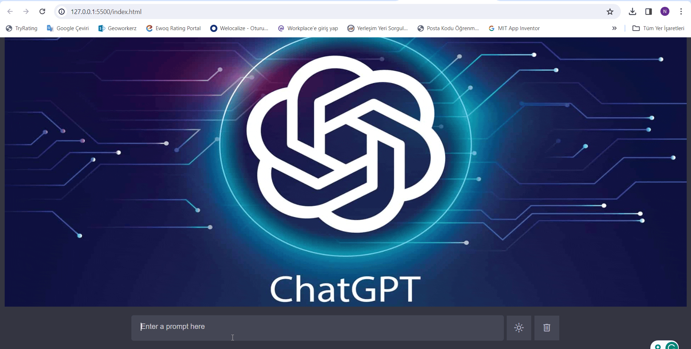

<h1>Chatgbt-Clone</h1>

ChatGBT Clone is a project that replicates the functionalities of ChatGBT using the provided API_KEY. It allows users to send fetch requests to the system, enabling the interpretation of questions in multiple languages and providing responses accordingly. The project is built using HTML5, CSS, and advanced JavaScript.

<h3>Features</h3>

- Seamless integration with the ChatGBT API for multilingual question interpretation and response.
- Utilizes HTML5, CSS, and advanced JavaScript for a modern and responsive user interface.
- Dark and light mode options for a personalized user experience.

<h3>Usage</h3>

1. Clone the repository to your local machine.
2. Obtain the API_KEY from ChatGBT and replace the placeholder in the code with your actual API_KEY.
3. Open the `index.html` file in a web browser.

<h3>Dark and Light Mode</h3>

The project offers both dark and light mode options for user preference. You can easily toggle between modes using the provided settings.

